<picture>
  <source media="(prefers-color-scheme: dark)" srcset="assets/card-dark.svg">
  
</picture>

I build AI tools and frameworks that make AI actually useful. By day I'm CTO at [Focus AI](https://focus-ai.io) in Luxembourg.

### What I've shipped

- **[second-brain-kit](https://github.com/ogabrielalonso/second-brain-kit)**: a self-hosted second brain for agent CLIs, so your AI knows you in every session.
- **[decoder](https://github.com/ogabrielalonso/decoder)**: turns any codebase into a cited, checked knowledge base. [Site](https://decoder-dev.vercel.app)
- **[personal-server-kit](https://github.com/ogabrielalonso/personal-server-kit)**: one command turns an Ubuntu machine into your own 24x7 server for AI coding sessions. [Site](https://personal-server-kit.vercel.app)
- **[website-cloner](https://github.com/ogabrielalonso/website-cloner)**: clones any website into a Next.js project and proves it with a pixel diff. [Site](https://website-cloner-dev.vercel.app)
- **[youtube-knowledge](https://github.com/ogabrielalonso/youtube-knowledge)**: uploads what a YouTube video teaches into your second brain. [Site](https://youtube-knowledge-dev.vercel.app)

Also a contributor to [vinzdg/codenotch](https://github.com/vinzdg/codenotch).

  <a href="https://www.linkedin.com/in/ogabrielalonso/">LinkedIn</a> &nbsp;·&nbsp; <a href="https://focus-ai.io">Focus AI</a>

